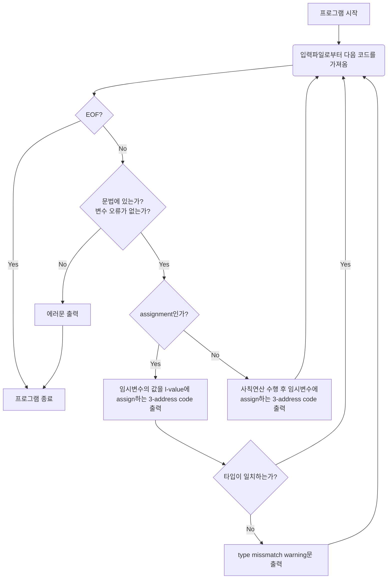

# Program Assignment #3

## 과제 개요

- 본 프로젝트는 2019학년도 1학기 컴파일러 실습 과제입니다.
- 주제: 사칙연산(+,-, *./) 과 Declaration 및 Assignment가 포함된 수식을 3-address code로 출력합니다.

## 개발 환경

- OS: Mac OS X 10.12.6 (Darwin Kernel Version 16.7.0)
- Language:
	- Lex
	- Yacc
	- C
- Compiler:
	- flex 2.6.4
	- bison (GNU Bison) 3.4
	- gcc-7 (Homebrew GCC 7.3.0_1) 7.3.0

## 빌드

`flex`와 `bison`을 이용하여 렉서와 파서의 C 소스코드를 생성하고 이를 빌드합니다.
```
$ flex calc.l
$ bison -d calc.y
$ gcc -o calc calc.tab.c lex.yy.c
```

## 실행

만들어진 `calc` 실행파일은 인자로 입력파일명을 받아서 입력파일에 있는 내용을 코드를 파싱하여 3-address code로 제너레이팅하여 `output.txt`로 출력합니다.

### 예시

`input.txt`의 내용은 아래와 같다고 가정합니다:
```
int a;  
float b;  
a = 2.0E-2+0.5;  
b = a*2+15;
```

이제 다음과 같이 실행합니다:
```
$ ./calc input.txt
```

출력된 `output.txt`의 내용은 아래와 같습니다:
```
t0 = 2.0E-2 + 0.5  
a = t0  
//warning: type mismatch  
t1 = a * 2  
t2 = t1 + 15  
b = t2  
//warning: type mismatch
```

## 프로그램 순서도



## calc.y의 rule

이 프로그램은 `calc.y`에 기재된 파싱 규칙들에 의해 동작합니다. 이 규칙들은 크게 `lines`, `stmts`, `stmt`, `decl`, `expr`로 구성되어 있습니다.

### lines

```
lines : /* empty */
      | lines '\n'
      | lines stmt
      ;
```

lines는 한 줄이 어떻게 구성되어 있는지를 나타냅니다. basis case는 아무 것도 없는 빈 줄입니다. 그리고 재귀적으로 lines와 개행으로 이루어진 줄이거나 lines와 stmt로 이루어진 줄입니다. stmt 룰은 아래에 기술합니다.

### stmts

```
stmts : stmt ';'
      ;
```

`stmts`는 수식이 세미콜론을 통해 구분된다는 것을 나타내는 규칙입니다.

### stmt

```
stmt : asgn
     | decl
     ;
```

`stmt`는 assignment문인 `asgn`과 변수 선언문인 `decl`로 나뉩니다.

### asgn

```
asgn : IDENTIFIER EQ expr {
	idx = lookup_sym_tab($1);  
    if (idx == -1) {  
	    fprintf(outfile, "Error!\n%s is unknown id\n", $1);  
	    exit(0);
    }
    fprintf(outfile, "%s = %s\n", $1, $3);
    if (type_check_flag != sym_tab[idx].type)  
        fprintf(outfile, "//warning: type mismatch\n");  
    type_check_flag = 0;
}  
     ;
```

`asgn`은 변수 이름(l-value)인 `IDENTIFIER`와 `=`와 계산식인 `expr`로 이루어집니다. 
- 변수명을 먼저 `lookup_sym_tab()`로 심볼테이블에 있는지 확인을 하고 없다면 에러문을 출력합니다. 오류가 없다면 올바른 3-address code를 출력합니다.
-  이때 타입 미스매치가 있는지 확인을 하는데 방식은 비트매스킹을 이용합니다. 타입 미스매치가 있다면 워닝문을 추가로 출력합니다.
- 다음 라인 분석에서 타입 미스매치가 발생여부를 파악하기 위해 `type_check_flag`를 0으로 클리어합니다.

### decl

```
decl : TYPE IDENTIFIER {
	if (lookup_sym_tab($2) != -1) {  
		fprintf(outfile, "Error!\n%s is already declared\n", $2);
        exit(0);
    }
    strcpy(sym_tab[sym_cnt].name, $2);  
    sym_tab[sym_cnt++].type = $1;
}
     ;
```

`decl`은 타입을 나타내는 `TYPE`과 변수명인 `IDENTIFIER`로 이루어집니다. 변수명을 먼저 `lookup_sym_tab()`로 심볼테이블에서 중복 확인을 하고 중복이라면 에러문을 출력합니다. 없다면 심볼테이블에 새로 등록해줍니다.

### expr

```
expr : FLOAT               { type_check_flag |= FLOAT_TYPE;  
                             strcpy($$, $1); }  
     | INT                 { type_check_flag |= INT_TYPE;  
                             strcpy($$, $1); }  
     | IDENTIFIER          {
	     idx = lookup_sym_tab($1);  
         if (idx == -1) {  
             fprintf(outfile, "Error!\n%s is unknown id\n", $1);  
             exit(0);  
         }  
         type_check_flag |= sym_tab[idx].type;  
         strcpy($$, $1); }  
     | expr '+' expr       {
		  sprintf(tmp_name, "t%d", next_tmp());  
          strcpy($$, tmp_name);  
          fprintf(outfile, "%s = %s + %s\n", tmp_name, $1, $3); }
       .
       .
       .
     | '(' expr ')'        { strcpy($$, $2); }  
	 | '-' expr %prec UMINUS {
		 sprintf(tmp_name, "t%d", next_tmp());  
         strcpy($$, tmp_name);  
         fprintf(outfile, "%s = -%s\n", $$, $2); }   
```

`expr`은 실제 infix 수식이 이루어진 형태를 나타내는 규칙입니다.
- 먼저 터미널인 `FLOAT`과 `INT`는 각 타입에 맞게 `type_check_flag`를 토글해줍니다.
- `IDENTIFIER`의 경우 `asgn`에서와 같이 심볼테이블에 있는지 확인하고 없다면 에러문을 출력하고 종료합니다. 정상적인 심볼이라면 그 타입을 `type_check_flag`에 토글하여 줍니다.
- `expr '+' expr`, `expr '-' expr`, `expr '*' expr`, `expr '/' expr`, `'-' expr %prec UMINUS`는 각각 `next_tmp()`로 생성된 인덱스로 임시변수에 계산결과를 assign하는 3-address code를 생성합니다.
- `'(' expr ')'`는 단순히 `expr`에서 올라온 내용을 올려보냅니다.


## 심볼테이블

중요한 함수 중 하나인 `lookup_sym_tab()`에 대해 설명합니다.

```
int lookup_sym_tab(const char *name)  
{  
  int i, ret = -1;  
  for (i = 0; i < sym_cnt; ++i) {  
    if (!strcmp(sym_tab[i].name, name)) {  
      ret = i;  
      break;  
    }  
  }  
  return ret;  
}
```

이 함수는 변수명을 인자로 받아 배열을 순회하여 문자열 매칭을 통해 `sym_tab`에 해당하는 변수명이 있는지 확인합니다.(탐색시간 $O(n)$)

`sym_tab`의 선언은 아래와 같습니다:

```
struct symbol_struct {  
    char name[256];  
    int type;  
};  
  
struct symbol_struct sym_tab[512];  
int sym_cnt = 0;
```

`symbol_struct`에서 변수명과 타입을 관리하게 되는데 이러한 구조체 배열이 `sym_tab`입니다.
**note**: 해시테이블이나 레드블랙트리를 이용하여 심볼테이블에서의 탐색을 각각 $O(1)$, $O(nlogn)$로  최적화 할 수 있습니다만 퍼포먼스가 과제의 중요사항은 아니라서 간단한 자료구조인 배열을 택했습니다.
